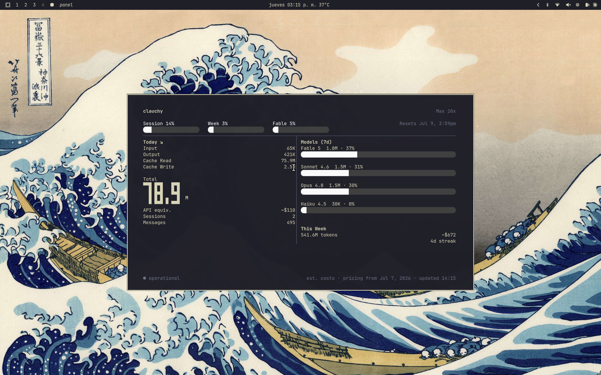

# clauchy

A zero-config Go binary that turns your Claude Code usage data into a live
Waybar icon and a full TUI dashboard.

<!-- screenshot placeholder -->


---

**Requirement**: a Nerd Font patched terminal (default on Omarchy) — needed for the dashboard's rounded progress bar caps (Powerline glyphs U+E0B4/U+E0B6). The Waybar icon is now painted by CSS `background-image` so no Nerd Font glyph is required for the bar itself.

---

## What it is

clauchy reads two sources of truth and brings them together in one place:

- **The Anthropic usage API** — the same server-side 5-hour session bar Claude
  Code itself uses. No approximation, no local reconstruction.
- **Your local JSONL transcripts** — per-day token counts, per-model breakdown,
  cost estimates, and your current streak, computed directly from
  `~/.claude/projects/`.

The binary has three modes:

| Mode | Command | What it does |
|------|---------|--------------|
| Dashboard — monochrome (default) | `clauchy` | Bubbletea TUI, white/gray tones matching the reference design |
| Dashboard — colorful | `clauchy --colorful` | Same TUI with Sky-accented colors and severity-mapped bars |
| Waybar module | `clauchy waybar` | One JSON line on stdout; designed for `return-type: json` |
| Installer | `clauchy install` | Idempotently patches `config.jsonc`, `style.css`, writes icon SVGs, and appends Hyprland window rules |
| Installer — colorful | `clauchy install --colorful` | Same as above but the on-click launches the dashboard in colorful mode (`clauchy --colorful`); re-running with or without the flag repairs the on-click either direction |

---

## Install

```bash
go install clauchy@latest
clauchy install
```

`clauchy install` makes the following changes (all idempotent — safe to run again
after an upgrade):

1. Adds a `custom/clauchy` module block to `~/.config/waybar/config.jsonc` with
   the correct `exec`, `return-type: json`, `interval`, and a floating-terminal
   `on-click`.
2. Registers `"custom/clauchy"` in your `modules-right` (or whichever
   `modules-*` array you use).
3. Appends a marked CSS block to `~/.config/waybar/style.css` that paints the
   Claude SVG logo via `background-image` in each severity color. The Waybar
   module box emits a single space `" "` so the box exists without a glyph.
4. Writes four SVG icon variants (recolored for low / mid / high / critical) to
   `~/.local/share/clauchy/`. These are referenced from the CSS block.
5. On Hyprland: appends a marked block of `windowrule` entries to
   `~/.config/hypr/hyprland.conf` so the dashboard panel opens floating,
   centered, and sized correctly. If `hyprland.conf` does not exist the step is
   skipped with a warning (non-Hyprland setups work fine without it).

All modified files are backed up to timestamped `.bak.<epoch>` names before any
write. Waybar is reloaded via SIGUSR2 and Hyprland via `hyprctl reload`
automatically.

---

## Why clauchy is different

**Correct 1-hour cache-write pricing per Anthropic's published rates.**
Claude transcripts distinguish two cache-write buckets: 5-minute writes (1.25×
base input rate) and 1-hour writes (2× base input rate). clauchy applies both
multipliers to the correct token bucket, matching Anthropic's published pricing
page. An optional `~/.config/clauchy/pricing.json` override file lets you
update rates for new models without rebuilding.

**Authoritative server-side 5-hour bar.**
The 5-hour utilization value comes directly from Anthropic's OAuth usage API —
the same number Claude Code's own rate-limit indicator uses. There is no local
estimation or approximation.

**Single static binary.**
clauchy compiles to one binary with no runtime dependencies. Install it, run
`clauchy install`, and it works. No Node.js, no Python, no daemon.

---

## Zero-config philosophy

clauchy discovers everything from your existing Claude Code setup:

- Credentials: `~/.claude/.credentials.json` (or `CLAUDE_CONFIG_DIR` if set)
- Transcripts: `~/.claude/projects/` (or `CLAUDE_CONFIG_DIR`)
- Waybar config: `~/.config/waybar/config.jsonc` and `style.css`

No configuration file is required. The only optional file is the pricing
override.

---

## Pricing override

To update or add model rates without rebuilding, create
`~/.config/clauchy/pricing.json`:

```json
{
  "claude-new-model": { "input": 5.00, "output": 15.00 }
}
```

Rates are USD per million tokens. The file merges with the built-in table; any
model you list overrides its built-in rate. Models not listed use the built-in
rates.

---

## Uninstall

Remove the `custom/clauchy` block and the `/* clauchy start */ … /* clauchy end
*/` CSS section from your Waybar files manually, then delete the binary:

```bash
rm "$(which clauchy)"
```

clauchy writes to: `~/.cache/clauchy/` (ephemeral usage cache), the Waybar
config files it patches during install, `~/.local/share/clauchy/` (SVG icons),
and (on Hyprland) `~/.config/hypr/hyprland.conf`. No files outside these
locations are written.

---

## Building from source

```bash
git clone https://github.com/jesusrob/clauchy
cd clauchy
go build -ldflags "-X main.version=$(git describe --tags)" -o clauchy .
```
